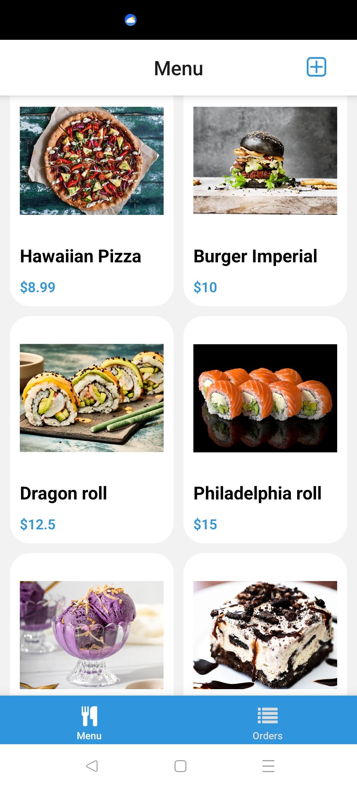
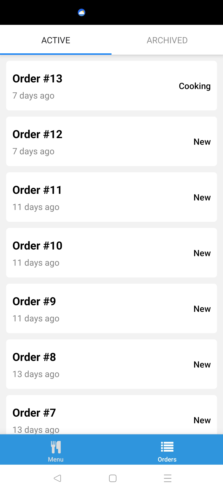
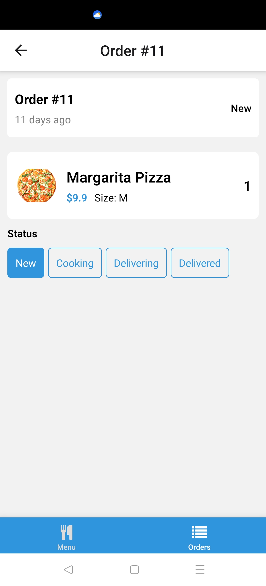
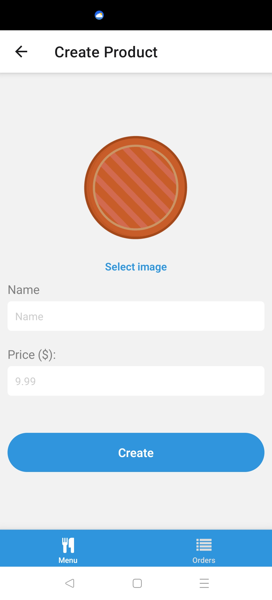

# 🍔 Food Ordering App (React Native + Expo)

## 📌 Overview

This is a **food ordering app** built with **React Native + Expo**, designed to help users order meals and allow admins to manage the menu and orders. The primary goal of this project was to learn how to use React Native and Expo while integrating **Supabase** for authentication, backend, and database management.

## 🚀 Features

### 👤 **User Role:**

- Sign up / Sign in with **Supabase authentication**.
- Browse available meals and select a **meal size**.
- Add meals to the **basket** and place an **order**.
- View **all past orders** and track their **status** (**New → Cooking → Delivering → Delivered**).

### 🛠️ **Admin Role:**

- Can switch between **admin panel** and **user view**.
- **Manage the menu**:
  - Add new meals.
  - Edit existing meals.
  - Delete meals.
- View **all active** and **completed** orders.
- Update the **status of orders** (**New → Cooking → Delivering → Delivered**).

## 🏗️ Tech Stack

### **Frontend:**

- **React Native** + **Expo**
- **Expo-Notifications** (for push notifications)

### **Backend & Database:**

- **Supabase** (authentication, database, backend)
- **Supabase Storage** (for storing images)

## 📌 Future Enhancements

- **Stripe Integration** for secure **online payments**.
- **Real-time updates** for order status using **Supabase subscriptions**.

## 🚀 Getting Started

### **1️⃣ Clone the Repository**

```sh
git clone https://github.com/KrisChe8/expo_react
cd expo_react
```

### \*\*2️⃣ Install Dependencies

```sh
npm install
```

### \*\*Start the App

```sh
expo start
```






<!--  -->
